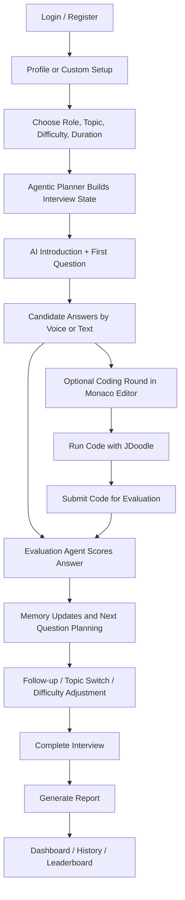

# IntervueX 🚀

## An AI-Powered Interview Platform

IntervueX is a full-stack interview practice platform that combines AI interview workflows with a modern web application. It uses an agentic AI architecture to run role-aware mock interviews, evaluate answers, execute code, generate reports, and adapt the interview flow based on the candidate's role, answers, and performance.

🌐 **Live Website:** [https://interview-backend-elqq.onrender.com/](https://interview-backend-elqq.onrender.com/)

🎥 **Demo Video:** [https://drive.google.com/file/d/1JKHLfKxKmr-XKn91Mq9XKHVCgm5gaLHe/view](https://drive.google.com/file/d/1JKHLfKxKmr-XKn91Mq9XKHVCgm5gaLHe/view)

---

## ✨ Features

### Agentic AI Interviewer
- Multi-agent interview flow with planner, question, evaluation, memory, coding, and report components
- Role-aware interviews for frontend, backend, fullstack, Java, Python, SQL, data science, and machine learning
- Adaptive question selection based on interview state, topic coverage, and candidate performance
- Human-like opening, follow-ups, topic switching, and difficulty adjustment

### Live Code Execution
- Integrated **Monaco Editor** for writing code
- Real-time code compilation and execution using **JDoodle API**
- Separate code run and code submit flow for coding rounds
- Supports coding interview simulations inside the browser

### Bi-Directional Audio & Voice Support
- Browser **SpeechRecognition API** for capturing candidate responses
- Browser **SpeechSynthesis API** for AI voice output
- Interactive interviewer experience with spoken prompts and replies

### Deep-Dive Performance Reports
- Overall score and topic-wise scoring
- Big-O time and space complexity analysis
- Strengths, weaknesses, and missed concepts
- Personalized study plan and next interview roadmap

### Customizable Interview Sessions
- Frontend, backend, fullstack, Java, Python, SQL, data science, and machine learning interview modes
- Multiple difficulty levels
- Text and coding interview modes
- Profile-based and custom setup flows

### Secure Authentication
- JWT authentication
- Google OAuth integration
- Protected routes and secure sessions

### Hardware Calibration Room
- Camera permission verification
- Microphone permission verification
- Device readiness checks before interviews
  
### AI Resume Analyzer
- Upload resumes in PDF format
- Generates ATS compatibility score
- Highlights strengths and weaknesses
- Identifies missing skills and keywords
- Suggests improvements for better shortlisting
- Generates role-specific interview questions from resume content
  
### Competitive Leaderboard
- Global leaderboard based on average interview performance
- Compare scores with other candidates
- Track ranking improvements over time
- Encourages consistent interview practice and skill development

---

## 🧭 Flowchart



---

## 🛠️ Tech Stack

### Frontend
- React.js (Vite)
- Tailwind CSS
- Axios
- React Router DOM
- Monaco Editor

### Backend
- Node.js
- Express.js
- MongoDB
- Mongoose
- Multer
- Cloudinary

### AI & External APIs
- Google Gemini 2.5 Flash API
- JDoodle API
- Google OAuth

---

## 📂 Project Structure

```bash
IntervueX/
│
├── frontend/
│   ├── public/
│   ├── src/
│   │   ├── components/
│   │   ├── layouts/
│   │   ├── lib/
│   │   └── pages/
│   ├── .env
│   └── dist/
│
├── backend/
│   ├── agents/
│   │   ├── plannerBrain.js
│   │   ├── questionOrchestrator.js
│   │   ├── evaluationEngine.js
│   │   ├── codingEngine.js
│   │   ├── memoryEngine.js
│   │   └── reportEngine.js
│   ├── services/
│   │   ├── aiPrompts.js
│   │   ├── interviewAgentService.js
│   │   ├── interviewPolicy.js
│   │   └── promptTemplates.js
│   ├── controllers/
│   ├── routes/
│   ├── models/
│   ├── middlewares/
│   ├── utils/
│   └── .env
│
└── README.md
```

---

## ⚙️ Environment Variables

### Backend (`/backend/.env`)

```env
MONGO_URI=your_mongodb_connection_string
PORT=8000
JWT_SECRET=your_secret_key
GEMINI_API_KEY=your_gemini_api_key
GOOGLE_CLIENT_ID=your_google_oauth_client_id
CLIENT_URL=http://localhost:5173
JDOODLE_CLIENT_ID=your_jdoodle_client_id
JDOODLE_CLIENT_SECRET=your_jdoodle_client_secret
CLOUDINARY_CLOUD_NAME=your_cloudinary_cloud_name
CLOUDINARY_API_KEY=your_cloudinary_api_key
CLOUDINARY_API_SECRET=your_cloudinary_api_secret
```

### Frontend (`/frontend/.env`)

```env
VITE_GOOGLE_CLIENT_ID=your_google_oauth_client_id
VITE_API_URL=http://localhost:8000
```

---

## 🚀 Installation & Setup

### Clone the Repository

```bash
git clone https://github.com/YourUsername/IntervueX.git
cd IntervueX
```

### Backend Setup

```bash
cd backend
npm install
npm run dev
```

### Frontend Setup

```bash
cd frontend
npm install
npm run dev
```

### Open in Browser

```bash
http://localhost:5173
```

---

## 🤝 Contributing

Contributions, issues, and feature requests are welcome.

Feel free to fork this repository and submit a pull request.

---

## 👨‍💻 Author

**Ayush Pratap Singh**

Built with React, Node.js, MongoDB, Gemini AI, JDoodle, and modern web technologies.

---

## ⭐ Support

If you found this project useful, please consider giving it a ⭐ on GitHub.
